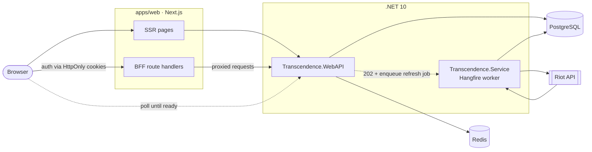

<div align="center">


# Transcendence

**A command deck for League of Legends analytics.**

Tier lists, champion builds, tracked pro solo-queue picks, and live summoner profiles. Fast, trustworthy, and unapologetically data-forward.

<!-- hero screenshot goes here — e.g. the LoL tier list or a summoner profile from apps/web -->

[](https://github.com/luisgon-dev/Transcendence/actions/workflows/ci-web-backend.yml)
[](https://github.com/luisgon-dev/Transcendence/actions/workflows/docker-images.yml)
[](LICENSE)
[](global.json)
[](apps/web)
[](package.json)

[**Live site →**](https://transcend.kronic.one) &nbsp;·&nbsp; [Sample profile](https://transcend.kronic.one/lol/summoners/na/Kronic-NA1)

</div>

---

## What is it?

Transcendence is a Riot analytics platform built for both the competitive climber and the casual browser. Climbers come for tier lists, matchups, and optimal builds; casual players come to check post-game stats and explore champions. Under the hood it's a single monorepo: a **.NET 10** Web API and background worker feed a **Next.js 16** frontend, with PostgreSQL, Redis, Hangfire, and a generated TypeScript API client wiring it all together.

The live site redeploys automatically once changes land on `main`.

## ✨ Highlights

<table>
<tr>
<td width="50%" valign="top">

**🏆 League of Legends**

- Tier list rankings
- Champion analytics — win rates, builds, and matchups by role, with tier / rank / patch filters
- Tracked pro solo-queue insights: top picks, builds, and player rosters by region (not tournament schedules/results)
- Summoner profiles — ranked stats, mastery, and match history with detailed post-game analytics
- Live game detection
- Search with prefix autosuggest, plus multi-search (up to 5 players) for champ-select — surfacing average rank, role coverage, and autofill risk

</td>
<td width="50%" valign="top">

**🛠 Platform**

- Email auth — register, login, token refresh, password reset
- User preferences + saved favorite summoners
- Admin dashboard — Hangfire queue visibility, recurring-job controls, audit logs, cache invalidation, service logs, and analysis metrics
- 80+ endpoints behind a committed OpenAPI contract
- Per-surface rate limiting and health probes

</td>
</tr>
</table>

## 🧱 Tech Stack

| Layer | Technology |
| --- | --- |
| **Backend API** | ASP.NET Core (.NET 10), Swagger / OpenAPI, health checks |
| **Worker** | .NET Worker Service + Hangfire (prioritized job queues) |
| **Data** | EF Core 10 over PostgreSQL; Redis for caching &amp; data protection |
| **Frontend** | Next.js 16.2 (App Router), React 19.2, TypeScript |
| **API contract** | OpenAPI → generated `@transcendence/api-client` (openapi-typescript + tsup) |
| **Tooling** | pnpm 10.22.0, Node 22, .NET SDK 10.0.102 |
| **Testing** | xUnit (.NET), Vitest (web), Playwright 1.58 (e2e) |
| **CI/CD** | GitHub Actions — tests, lint, OpenAPI sync check, Docker image builds |

## 🗺 Architecture



**The async refresh flow:** a profile request returns `200` immediately when data is cached. If it's missing, the API returns `202 Accepted`, takes a refresh lock, and enqueues a Hangfire job on the prioritized `refresh-high` queue. The worker fetches from the Riot API and ingests matches into PostgreSQL while the client polls the same endpoint until the data appears. The Next.js BFF proxies authenticated requests so tokens stay in HttpOnly cookies — never exposed to browser JavaScript.

## 🚀 Quick Start

> **Prerequisites:** [.NET SDK 10.0.102](global.json) · [Node 22](.nvmrc) · [pnpm 10.22.0](package.json) · Docker (for PostgreSQL &amp; Redis).
>
> Install [pnpm](https://pnpm.io/installation) (the repo pins `pnpm@10.22.0` via the `packageManager` field), then run any script with `pnpm <script>`. Already a Corepack user? `corepack enable` picks up the pinned version automatically — both work.

```bash
# 1. Clone
git clone https://github.com/luisgon-dev/Transcendence.git
cd Transcendence

# 2. Configure environment
cp .env.example .env
cp apps/web/.env.example apps/web/.env.local

# 3. Install dependencies + set up the pre-commit hook
pnpm install
pnpm hooks:install

# 4. Bring up the full stack (API, worker, web, PostgreSQL, Redis) in the background
pnpm dev:stack:up
```

Then open:

| URL | What |
| --- | --- |
| http://localhost:3000 | Web app |
| http://localhost:3000/api/health | Web process liveness |
| http://localhost:8080 | Web API |
| http://localhost:8080/health/ready | Health — readiness |
| http://localhost:8080/health/live | Health — liveness |

Stop the stack with `pnpm dev:stack:down`.

<details>
<summary><strong>Optional: run the web app on its own</strong></summary>

If your backend is already running (locally, or pointed at a remote API via `TRN_BACKEND_BASE_URL` in `apps/web/.env.local`), you can iterate on just the frontend:

```bash
pnpm web:dev      # Next.js dev server on :3000
pnpm web:build    # production build
pnpm web:lint     # ESLint
pnpm web:test     # Vitest
```

</details>

<details>
<summary><strong>Optional: developer tooling (pgAdmin, container logs)</strong></summary>

Two extra services ship in `compose.yml` behind profiles:

```bash
docker compose --profile local-tools up   # pgAdmin → http://localhost:5050
docker compose --profile ops-tools up      # Dozzle (container log viewer) → http://localhost:9999
```

</details>

<details>
<summary><strong>Optional: backend &amp; solution details</strong></summary>

The .NET solution (`Transcendence.sln`) contains four active projects — see [Repository Layout](#-repository-layout). Run the backend test suites with:

```bash
pnpm backend:test
# runs:
#   tests/Transcendence.Service.Core.Tests/Transcendence.Service.Core.Tests.csproj
#   tests/Transcendence.WebAPI.Tests/Transcendence.WebAPI.Tests.csproj
```

> `Transcendence.WebAdminPortal/` is a stale `bin/obj` artifact, not part of the solution — ignore it.

</details>

## 📂 Repository Layout

```
Transcendence/
├─ Transcendence.WebAPI/         # REST API — auth, Hangfire admin, Swagger, health checks
├─ Transcendence.Service/        # Hangfire background worker (prioritized job queues)
├─ Transcendence.Service.Core/   # Shared domain: services, jobs, Riot integrations, analytics
├─ Transcendence.Data/           # EF Core — DbContext, models, repositories
├─ apps/web/                     # Next.js 16 frontend + BFF route handlers (TypeScript)
├─ packages/api-client/          # Generated TS client (@transcendence/api-client)
├─ openapi/transcendence.v1.json # Committed OpenAPI contract — source of truth
├─ tests/                        # Backend unit tests (Service.Core, WebAPI)
├─ e2e/                          # Playwright tests (navigation, smoke, summoner, tierlist)
├─ docs/                         # DEVELOPMENT.md · API.md · ARCHITECTURE.md
├─ scripts/                      # OpenAPI export, e2e, and ops helpers
└─ config/                       # backend.shared.json
```

## ⚙️ Common Commands

All commands run from the repo root via `pnpm <script>`.

| Command | Description |
| --- | --- |
| `dev:stack:up` / `dev:stack:down` | Start / stop the full Docker Compose stack |
| `web:dev` | Next.js dev server (`:3000`) |
| `web:build` · `web:lint` · `web:test` | Build / lint / Vitest for the web app |
| `backend:test` | Run both .NET test projects |
| `api:gen` | Export the OpenAPI spec **and** regenerate the TS client |
| `api:check` | Verify the committed spec &amp; client haven't drifted (used in CI) |
| `e2e:local` | Run Playwright against `localhost:3000` |
| `e2e:stack` | Spin up the Docker stack, then run e2e |
| `hooks:install` | Configure the pre-commit hook |

## 🔄 The API Contract Loop

The OpenAPI contract (`openapi/transcendence.v1.json`) is the single source of truth between backend and frontend:

1. You change a .NET controller or DTO.
2. `pnpm api:gen` re-exports the spec and regenerates `@transcendence/api-client`.
3. The **pre-commit hook** does this automatically when API-relevant files are staged, then runs lint checks — so the spec and client never drift.
4. CI runs `api:check` on every push and PR to confirm they're in sync.

## 📚 Documentation

| Doc | Covers |
| --- | --- |
| [`docs/DEVELOPMENT.md`](docs/DEVELOPMENT.md) | Prerequisites, secrets, local run modes, testing, OpenAPI/client generation |
| [`docs/ARCHITECTURE.md`](docs/ARCHITECTURE.md) | System boundaries, refresh flows, caching, ingestion, BFF behavior |
| [`docs/API.md`](docs/API.md) | Endpoint areas, auth semantics, status-code expectations, contract notes |
| [`AGENTS.md`](AGENTS.md) | Quick-reference commands and architecture for coding agents |

## 🤝 Contributing

Contributions are welcome. The fast path:

1. Fork and branch from `main`.
2. `pnpm install && pnpm hooks:install`.
3. Make your change. If you touch the API, let the pre-commit hook regenerate the contract (or run `pnpm api:gen`).
4. Make sure things pass locally — `pnpm backend:test`, `pnpm web:test`, `pnpm web:lint`, and `pnpm api:check`.
5. Open a PR. CI runs backend tests (.NET), frontend tests (Vitest), ESLint, builds, and the OpenAPI sync check; `docker-images.yml` builds container images for the `webapi`, `service`, and `web` components with change detection.

> Don't hand-edit EF migration files — update the EF model first, then generate migrations with `dotnet ef migrations add ...`.

## 📄 License

[GNU General Public License v3](LICENSE) — Copyright © 2026 luisgon-dev.
