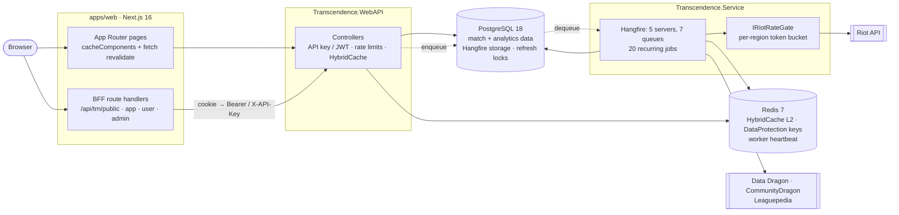
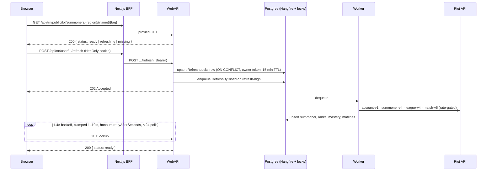

<div align="center">


# Transcendence

**League of Legends analytics: a .NET 10 ingestion and analytics backend behind a Next.js 16 frontend.**

[](https://github.com/luisgon-dev/Transcendence/actions/workflows/ci-web-backend.yml)
[](https://github.com/luisgon-dev/Transcendence/actions/workflows/docker-images.yml)
[](LICENSE)
[](global.json)
[](apps/web/package.json)
[](compose.yml)

[Live site](https://transcend.kronic.one) · [API](https://api.kronic.one/health/ready) · [Sample profile](https://transcend.kronic.one/lol/summoners/na/Kronic-NA1)

</div>

---

Transcendence crawls Riot's ranked ladders on 10 platforms and ingests matches and timelines into
PostgreSQL. A Hangfire worker then precomputes champion analytics on a schedule: tier grades,
builds, matchups, item and rune stats, and per-decision Build Lab win rates. A REST API serves the
results to a Next.js App Router frontend, and a backend-for-frontend (BFF) layer in that frontend
keeps auth tokens out of the browser.

Surfaces: tier list, champion pages (builds, matchups, synergy), tracked pro and one-trick builds,
item and rune pages, ladders, summoner profiles with match history and post-game breakdowns, live
game lookup, and a 5-player champ-select multi-search.

**Contents:** [Architecture](#architecture) · [Data pipeline](#data-pipeline) ·
[Analytics](#analytics-methodology) · [API](#api) · [Frontend](#frontend) ·
[Observability](#observability) · [CI/CD](#cicd-and-deployment) ·
[Local development](#local-development) · [Testing](#testing) · [Layout](#repository-layout)

## Architecture


```mermaid
flowchart LR
  Browser([Browser])

  subgraph web["apps/web · Next.js 16"]
    Pages["App Router pages<br/>cacheComponents + fetch revalidate"]
    BFF["BFF route handlers<br/>/api/trn/public · app · user · admin"]
  end

  subgraph api["Transcendence.WebAPI"]
    Ctl["Controllers<br/>API key / JWT · rate limits · HybridCache"]
  end

  subgraph worker["Transcendence.Service"]
    HF["Hangfire: 5 servers, 7 queues<br/>20 recurring jobs"]
    Gate["IRiotRateGate<br/>per-region token bucket"]
  end

  PG[("PostgreSQL 18<br/>match + analytics data<br/>Hangfire storage · refresh locks")]
  Redis[("Redis 7<br/>HybridCache L2 · DataProtection keys<br/>worker heartbeat")]
  Riot[["Riot API"]]
  Ext[["Data Dragon · CommunityDragon<br/>Leaguepedia"]]

  Browser --> Pages
  Browser --> BFF
  Pages --> Ctl
  BFF -->|"cookie → Bearer / X-API-Key"| Ctl
  Ctl --> PG
  Ctl --> Redis
  Ctl -.->|enqueue| PG
  PG -.->|dequeue| HF
  HF --> Gate --> Riot
  HF --> Ext
  HF --> PG
  HF --> Redis
```

| Project | Role |
| --- | --- |
| [`Transcendence.WebAPI`](Transcendence.WebAPI) | ASP.NET Core REST API. It serves reads and only enqueues Hangfire jobs, never runs them. It holds **no Riot API key** and has no project reference to `Transcendence.Data`: controllers handle HTTP concerns and delegate to `Service.Core`. |
| [`Transcendence.Service`](Transcendence.Service) | Worker host. Runs the Hangfire servers and recurring jobs, owns all Riot traffic, and is the **EF migrations assembly**: it applies migrations on startup (`Database:AutoMigrate`), or runs them alone with `Database:MigrateOnly=true`. |
| [`Transcendence.Service.Core`](Transcendence.Service.Core) | Domain services shared by both hosts: ingestion, analytics compute, auth, live game, the Riot client (Camille), and job definitions. `AddTranscendenceCore` is shared; `AddTranscendenceWorkerCore` and `AddTranscendenceLeagueRiot` are registered by the worker only. |
| [`Transcendence.Data`](Transcendence.Data) | EF Core 10 `DbContext` (Npgsql), entities, and repositories. |
| [`apps/web`](apps/web) | Next.js 16 App Router frontend with BFF route handlers. Builds to `output: "standalone"`. |
| [`packages/api-client`](packages/api-client) | `@transcendence/api-client`: types generated with `openapi-typescript` from the committed spec, wrapped with `openapi-fetch`. |
| [`packages/web-routes`](packages/web-routes) | Maps a URL to its route template. The Web Vitals reporter, its collector, and the Lighthouse budgets share it so their metrics use the same labels. |

Configuration is layered in both hosts: `config/backend.shared.json`, then each host's
`appsettings.json`, then environment variables (`Section__Key`).

### Summoner refresh flow

A lookup never blocks on Riot. The profile read returns cached state immediately, and a refresh is
a separate, signed-in, lock-guarded job:


```mermaid
sequenceDiagram
  participant B as Browser
  participant W as Next.js BFF
  participant A as WebAPI
  participant P as Postgres (Hangfire + locks)
  participant S as Worker
  participant R as Riot API

  B->>W: GET /api/trn/public/lol/summoners/{region}/{name}/{tag}
  W->>A: proxied GET
  A-->>B: 200 { status: ready | refreshing | missing }
  B->>W: POST /api/trn/user/.../refresh (HttpOnly cookie)
  W->>A: POST .../refresh (Bearer)
  A->>P: upsert RefreshLocks row (ON CONFLICT, owner token, 15 min TTL)
  A->>P: enqueue RefreshByRiotId on refresh-high
  A-->>B: 202 Accepted
  P-->>S: dequeue
  S->>R: account-v1 · summoner-v4 · league-v4 · match-v5 (rate-gated)
  S->>P: upsert summoner, ranks, mastery, matches
  loop 1.4× backoff, clamped 1–10 s, honours retryAfterSeconds, ≤ 24 polls
    B->>A: GET lookup
  end
  A-->>B: 200 { status: ready }
```

A signed-in refresh can also chain a `FullHistoryBackfillJob` on the `history-backfill` queue. That
job writes compact `SummonerMatchFacts` rows for older games.

## Data pipeline

### Ingestion sources

| Source | Job · schedule | What it does |
| --- | --- | --- |
| Apex ladders | `high-elo-profile-refresh` · every 2 h | Pulls Challenger, Grandmaster, and Master solo queue on NA1, EUW1, KR, EUN1, BR1, JP1, TR1, LA1, LA2, and OC1. Skips players whose tier, division, LP, and W/L haven't changed, but re-fetches each one at least every 24 h. Flags one-tricks (30 of the last 50 games on one champion). |
| Analytics producer | `champion-analytics-ingestion` · every 2 min | Fans out per region. Pulls from candidate pools in priority order (tracked pros/OTPs → favorites → Emerald+ → any active player), stalest first. Per-patch targets are 5k minimum and 25k target matches, weighted by region. Backpressure shrinks batches at a queue depth of 5k and stops them at 10k. |
| User refresh | `refresh-high` queue | Fetches 2 pages of ranked, 2 pages of all modes, and a non-ranked backfill of up to 40 pages (100 IDs per page). |
| Pro roster | `pro-roster-discovery` · daily 03:15 | Seeds from [`docs/seeds/`](docs/seeds) via the admin CSV importer. A Leaguepedia cargo query proposes candidates that wait for admin approval. |
| Static data | `detect-patch` · every 6 h | Data Dragon `versions.json` and `championFull.json`, plus CommunityDragon items, perks, and champion roles. `ChampionVersion` hashes numeric champion stats to detect balance changes. |

The analytics path runs in "lightweight" mode: it accepts only the active and newest patch, and it
stores unknown participants as local stub summoners instead of resolving them. A new patch is
promoted once ≥ 5 regions have ≥ 200 matches on it, or after 72 h.

### Riot request budget

Every Riot call in the worker goes through `IRiotRateGate`
([`RiotRateGate.cs`](Transcendence.Service.Core/Services/RiotApi/RiotRateGate.cs)). Each routing key
gets its own token bucket: burst 16, refilled at 3 tokens per 4 s. That is 45 requests/min, under the
key's 100 per 2 min limit. A call waits at most 30 s for a token and is then rejected; the match is
retried on a later refresh. A final `429` pauses and drains that region for up to 10 minutes. The
gate is in-process, so budgets are not shared across worker replicas.

| Path | Riot calls |
| --- | --- |
| Match, lightweight | 1 match-v5 |
| Match, full | 1 match-v5 + 3 per unknown participant (summoner-v4, account-v1, league-v4) |
| Ranked timeline | +1 |
| Match-ID listing | 1 per 100 IDs |

### Storage

- **Per match:** `Matches` (patch, queue, platform), `MatchParticipants` (KDA, gold, CS, vision,
  spells, physical/magic/true damage), final items, rune pages, bans, and team objectives.
- **Timelines** (queue 420 only): gold/XP/CS/level snapshots every 2 min plus a minute-15 anchor,
  ordered item purchases, and skill orders. With Build Lab enabled, the interval drops to 1 min and
  the worker also stores item lifecycle events, rank context, and non-item `jsonb` event payloads.
- **Idempotency:** `Matches.MatchId` is unique, and so is `(MatchId, SummonerId)` on participants.
  A duplicate-key batch falls back to saving one match at a time. Timelines are replaced
  delete-then-insert under a per-match advisory lock.
- **Tuning, no partitioning:** tables are not partitioned. Migrations pin `n_distinct` on the
  heavily clustered event and snapshot tables and set per-table autovacuum/analyze thresholds.
  [`scripts/ci/check-migrations.sh`](scripts/ci/check-migrations.sh) rejects new blocking
  `CreateIndex` and `defaultValueSql` column adds on the hot tables.
- **Retention:** [`archive-old-patches.sh`](scripts/ops/archive-old-patches.sh) runs weekly and keeps
  the newest 3 patches plus the active one. It streams 13 tables out with `COPY | gzip` to cold
  storage, verifies row counts, then deletes with batched cascades (20k rows per batch).
  `ChampionMatchupFact` has no FK to `Matches`, so matchup history survives archiving.

### Job topology

Hangfire runs on PostgreSQL storage with a sliding invisibility timeout and a global
`AutomaticRetry` of 1. It is split into five servers, so one slow lane can't starve another:

| Server | Queues (priority order) | Workers | Workload |
| --- | --- | --- | --- |
| main | `refresh-high` → `default` → `refresh-low` | 24 | User refreshes, live-game probes, general jobs |
| analytics | `analytics-warm` | 4 | Cache warming, adaptive analytics refresh |
| timeline | `timeline-ingest` | 8 | Timeline fetch and parse |
| discovery | `discovery` | 8 | Producer-driven summoner refreshes (Riot-bound) |
| history | `history-backfill` | 2 | Full-history backfill |

Worker counts come from `Jobs:Hangfire:Workers:*`.

<details>
<summary><strong>Recurring jobs</strong> (production <code>stable</code> profile, UTC)</summary>

The set is defined in
[`WorkerRecurringJobPolicy.cs`](Transcendence.Service.Core/Services/Jobs/Configuration/WorkerRecurringJobPolicy.cs).
A profile under `Jobs:SchedulingProfiles` can override any job's cron or enabled flag. At startup
the worker verifies registration (3 attempts) and fails if a mandatory job is missing.

| Job | Cron | Notes |
| --- | --- | --- |
| `champion-analytics-ingestion` | `*/2 * * * *` | Mandatory; ingestion producer |
| `refresh-lock-lifecycle-cleanup` | `*/5 * * * *` | Mandatory |
| `retry-failed-matches` | `0 * * * *` | Mandatory |
| `detect-patch` | `0 */6 * * *` | Mandatory |
| `refresh-champion-analytics-adaptive` | `*/5 * * * *` | Fires after 250 new matches (100 during a new-patch ramp) |
| `summoner-maintenance` | `*/5 * * * *` | |
| `match-timeline-backfill` | `*/5 * * * *` | 1,500 per batch, current patch, 60 min cooldown |
| `poll-live-games` | `*/2 * * * *` | Favorites; ≤ 30 summoners and ≤ 20 Riot calls per run |
| `ingestion-health-alert` | `*/5 * * * *` | Webhook alert |
| `refresh-build-lab-stats` | `*/15 * * * *` | ≤ 20k matches per run |
| `warm-default-champion-profiles` | `0 * * * *` | |
| `refresh-pro-analytics` | `20 * * * *` | |
| `refresh-precomputed-analytics` | `30 * * * *` | Tier grades and tabular core |
| `refresh-champion-matchups` | `35 * * * *` | |
| `refresh-build-resource-analytics` | `40 * * * *` | Build Atlas |
| `refresh-champion-build-snapshots` | `10 */6 * * *` | |
| `high-elo-profile-refresh` | `0 */2 * * *` | Apex crawl |
| `pro-roster-discovery` | `15 3 * * *` | Leaguepedia |
| `refresh-champion-analytics` | `0 4 * * *` | Disabled in `stable`; the adaptive job replaces it |
| `rune-selection-integrity-backfill` | `*/15 * * * *` | Disabled in `stable` |

</details>

## Analytics methodology

### Tier grades

[`ChampionTierScorer`](Transcendence.Service.Core/Services/Analytics/ChampionTierScorer.cs) grades
each champion within its role using empirical-Bayes shrinkage:

```
posterior = (W + μ·k) / (G + k)      μ = role baseline win rate
score     = posterior − μ            k = per-role Beta-prior strength (method of moments), clamped 50–2000
```

| Grade | S | A | B | C | D |
| --- | --- | --- | --- | --- | --- |
| Score | ≥ +3.0 pp | ≥ +1.5 pp | ≥ −1.5 pp | ≥ −3.0 pp | below |

The cutoffs are absolute, so S can be empty on a balanced patch and overflow on a broken one.
A champion below the low-sample gate is capped at B; the gate is 0.3 % of the role's games, clamped
to 50–500. Sample floors also rise as a patch ages: 10, 40, 70, then 100 games at < 24 h, < 96 h,
< 240 h, and steady state. All tuning lives in
[`TieringOptions`](Transcendence.Service.Core/Services/Analytics/Models/TieringOptions.cs) and binds
from `Analytics:Tiering`.

Scopes are queue (Solo, Flex, ARAM, Arena) × rank (`ALL`, `EMERALD_PLUS`, or an exact tier) × region
× patch. Rank is each player's *current* solo rank. Grades are precomputed and persisted for region
`ALL` × rank `ALL`/`EMERALD_PLUS`, along with patch-over-patch movement.

### Builds, matchups, synergy

- **Builds:** core items appear in ≥ 70 % of games. Builds are grouped by the first 4 core
  legendaries plus rune page; a group needs ≥ 30 games, and the top 3 are ranked by games × win rate.
- **Matchups:** same lane, opposite team, with gold/XP difference at minute 15 from the timeline
  anchor. A matchup needs ≥ 30 games; each champion shows 5 counters and 5 favorable matchups.
  Results are computed as resumable generations in 250-match / 8-champion batches.
- **Synergy:** ≥ 30 games per pair, top 10 partners.
- **Pro builds:** solo-queue games from `TrackedProSummoner` rows (pros and detected one-tricks),
  cached as `AnalyticsResponseSnapshot` rows.

### Build Lab

Build Lab gives step-by-step decision win rates: starter, item *N*, boots, rune page, rune slot, and
summoner spells.

- **Gold adjustment:** win rates are adjusted for team gold difference, bucketed at
  ±750 and ±2,500.
- **Shrinkage:** each option's lift is shrunk toward its all-games value with
  `keep = n / (n + 1000)`. The backtest in
  [`scripts/analysis/build-lab-backtest.sql`](scripts/analysis/build-lab-backtest.sql) showed that
  unshrunk lifts predict worse than no lift at all, which is why k = 1000 was chosen.
- **Gates:** 100 games minimum; a recommendation also needs a ≥ 5 % pick rate, and matchup or region
  scopes need 150 games.
- **Prior patches:** weighted `[1, 0.25, 0.25]`, or 1.0 when nothing relevant changed.
- **Storage:** counts only grow (no generations), and 4 patches are retained.

Build Lab is feature-flagged. The worker and API read `Analytics:BuildLab:Enabled`
(`BUILD_LAB_ENABLED`) and the web app reads `TRN_FEATURE_BUILD_LAB`. Both are off by default
locally and on in production.

### Build Atlas

Build Atlas holds item and rune analytics. It is built from queue-420 matches in 500-match batches,
with a full rebuild once per patch and hourly in-place additions under an advisory lock
([`BuildResourceSnapshotRefresher.cs`](Transcendence.Service.Core/Services/Analytics/Implementations/BuildResourceSnapshotRefresher.cs)).

## API

83 endpoints across 15 controllers. The committed contract is
[`openapi/transcendence.v1.json`](openapi/transcendence.v1.json); see [`docs/API.md`](docs/API.md)
for status-code semantics.

| Area | Prefix |
| --- | --- |
| Summoner lookup, search, refresh, multi-search, live game | `api/lol/summoners` |
| Summoner stats and matches | `api/lol/summoners/{summonerId:guid}` |
| Tier list, patches, regions, items/runes, champions, pro, Build Lab | `api/lol/analytics/*` |
| Leaderboards, static data | `api/lol/leaderboards`, `api/lol/static` |
| Auth, API keys, current user (favorites, preferences, linked Riot account) | `api/auth`, `api/auth/keys`, `api/users/me` |
| Admin: jobs, queues, failed-job retry, cache, audit log, logs, pro roster | `api/admin`, `api/admin/pro-summoners` |

**Auth**
- **App keys:** the default scheme is an API key sent in `X-API-Key` (`trn_<hex>`, stored as SHA-256).
- **User JWTs:** HS256, 15-minute access tokens.
- **Refresh tokens:** 64 random bytes, stored as SHA-256, valid 7 days, rotated on every use. Reusing
  a rotated token revokes the whole token family.
- **Passwords:** PBKDF2-SHA256 with 310k iterations.
- **Policies:** `AppOnly`, `UserOnly`, `AppOrUser`, `AdminOnly` (JWT plus the `admin` role).
- **Admins** are granted from `Auth:AdminBootstrap:Emails`. Riot RSO sign-in and SMTP password
  reset are optional.

**Rate limits** use fixed 1-minute windows and return `429` with no queueing. The per-IP limits
exempt private and loopback addresses:

| Policy | Limit | Partition |
| --- | --- | --- |
| `search-read` | 600 | IP |
| `expensive-read` | 120 | IP |
| `multisearch-read` | 60 | IP |
| `auth-refresh` / `auth-login` / `auth-register` | 20 / 8 / 4 | IP |
| `admin-write` | 30 | global |

**Caching:**
- **HybridCache:** in both hosts, L1 in memory for 5 min and L2 in Redis for 1 h, with an 8 MiB
  payload cap. It is invalidated by tag (`analytics`, `patch:{v}`, `summoner-stats:{id}`, and pro
  tags).
- **Durable snapshots:** the heavy surfaces also persist Postgres snapshots (`ChampionBuildSnapshot`,
  `ChampionMatchupSnapshot`, `AnalyticsResponseSnapshot`, `BuildResourceSnapshot`) so a cold cache
  never recomputes on the request path.

**Errors and health:**
- **Errors:** all come back as RFC 7807 `ProblemDetails` carrying a `traceId`.
- **`/health/live`:** runs no checks.
- **`/health/ready`:** checks Postgres `CanConnect` and Redis `PING`. The container `HEALTHCHECK`
  uses this endpoint.

## Frontend

**Rendering:**
- **Prerendered shells:** `cacheComponents` is on, so static parts of a page are prerendered and
  dynamic parts stream in through `<Suspense>`.
- **Freshness:** set per fetch with `next.revalidate`, as below.
- **Stable cache keys:** cacheable reads omit the `x-trn-request-id` correlation header, which
  would otherwise split the fetch-cache key.

| Data | `revalidate` |
| --- | --- |
| Data Dragon static data | 86400 |
| Tier list, champion pages, items, runes | 3600 |
| Pro builds | 1800–3600 |
| Patch list | 600 |
| Leaderboards, analytics status | 60 |
| Summoner lookup | `no-store` |

**BFF proxies** ([`app/api/trn`](apps/web/app/api/trn)). All four share
[`lib/trnProxy.ts`](apps/web/lib/trnProxy.ts), which strips cookies, rewrites `x-forwarded-for` to a
trusted client IP, rejects path traversal, and maps timeouts to `504 BACKEND_TIMEOUT` and
connection failures to `503 BACKEND_UNREACHABLE`.

| Route | Credential | Guard |
| --- | --- | --- |
| `/api/trn/public/*` | none | Allowlist: `GET lol/summoners/**`, `GET lol/analytics/build-lab/{id}` |
| `/api/trn/app/*` | server-held `X-API-Key` | Allowlist: multi-search, live game, live-game probe |
| `/api/trn/user/*` | `Bearer` from HttpOnly cookie | Origin check on unsafe methods; one refresh-and-retry on `401` |
| `/api/trn/admin/*` | `Bearer` + session role | Admin role check; origin check |

**Session handling:**
- **Cookies:** tokens live in `trn_access_token`, `trn_access_expires_at`, and `trn_refresh_token`,
  all HttpOnly, SameSite=Lax, and Secure in production.
- **Proactive refresh:** [`proxy.ts`](apps/web/proxy.ts), the Next 16 middleware, refreshes the
  access token on page navigations when it is within 60 s of expiry. It never clears cookies on a
  transient failure.

The UI is built on Tailwind v4 oklch tokens with light and dark themes, plus Radix-backed
primitives. See [`DESIGN.md`](DESIGN.md).

## Observability

- **Metrics:** OpenTelemetry → Prometheus.
  - **Endpoints:** the API serves `/metrics`, the worker listens on `:9464`, and the web process
    serves Web Vitals aggregates at `/api/telemetry/metrics`.
  - **Custom meters:** `Transcendence.IngestionThroughput`, `.RefreshLocks`, `.AnalyticsRefresh`,
    `.BuildLab`, `.RiotRateGate`, `.Leaderboards`, plus HybridCache, runtime, and HTTP meters.
- **Real-user monitoring:** the frontend beacons CLS, FCP, INP, LCP, and TTFB to
  `/api/telemetry/web-vitals`, labeled by route template.
- **Monitoring stack** ([`config/monitoring`](config/monitoring)): Prometheus 3 (180-day
  retention), Grafana 13, node, postgres, and redis exporters.
  - **Dashboards (9):** fleet, read API, Riot API, ingestion and rate gate, analytics refresh, Build
    Lab, worker runtime, web performance, browser Web Vitals.
  - **Alerts (18), sent to Discord:** scrape targets down, API 5xx rate and p95 latency, Postgres
    connection saturation, Redis rejections, disk space, stale or failing matchup and Build Lab
    refreshes, Web Vitals p75 regressions, and Lighthouse score or LCP regressions.
- **Worker liveness:** a watchdog thread writes a heartbeat to `/tmp/worker-heartbeat` and to Redis.
  If the heartbeat is stale for more than 10 min, the worker exits with code 70 so the container
  restarts.
- **Logs:** JSON-lines operational logs per service, rotated at 10 MB with 5 files kept.
- **Scheduled reports:** a nightly Lighthouse sweep of 15 production routes feeds node-exporter's
  textfile collector, and a daily read-only Postgres performance report is written to disk.

## CI/CD and deployment

**CI** ([`ci-web-backend.yml`](.github/workflows/ci-web-backend.yml)) runs on every PR and every push
to `main`:

| Job | Checks |
| --- | --- |
| `backend` | `dotnet test Transcendence.sln`, including Testcontainers integration tests on Postgres 18 |
| `web` | `pnpm api:check` (fails if the OpenAPI spec drifted), ESLint, Vitest, production build |
| `audit` | `pnpm audit --audit-level=high` |
| `performance` | Migrates and seeds Postgres. Runs k6 against p95 budgets (ready < 200 ms; leaderboards < 500–750 ms; query matrix < 1.5 s) and Lighthouse budgets (performance ≥ 0.8, LCP ≤ 4 s, CLS ≤ 0.1, TBT ≤ 350 ms, ≤ 1.6 MB) |
| `migration-safety` | `check-migrations.sh` plus `ef migrations has-pending-model-changes` |
| `migration-apply` | Applies the full migration chain to an empty database |

**Images** ([`docker-images.yml`](.github/workflows/docker-images.yml)):
- **Components:** `webapi`, `service`, `web`, and `perf`, built as a matrix.
- **Path filters:** each component rebuilds only when its paths change. Release tags rebuild all of
  them.
- **Publishing:** images go to GHCR, tagged `:main`, `sha-<short>`, and semver. Each image ships an
  SBOM and max-mode provenance, and is signed with **cosign keyless** (GitHub OIDC).
- **Supply chain:** all actions are SHA-pinned, and Dependabot runs weekly for npm, NuGet, Actions,
  and Docker.
- **Runtime:** every Dockerfile is multi-stage and digest-pinned, runs as non-root, and bakes in a
  `HEALTHCHECK`.

**Deploy** is pull-based. On the production host, a systemd timer runs
[`poll-deploy.sh`](scripts/ops/poll-deploy.sh) every 60 s:

1. Resolve each remote `:main` digest and its `org.opencontainers.image.revision` label, and compare
   them with the running container.
2. **Verify the signature:** run `cosign verify` (from a digest-pinned container) on the exact digest,
   requiring `docker-images.yml` on `refs/heads/main` as the signer. An unverified release is never
   pulled; after the pull, the local `:main` must still be the verified digest.
3. **Worker first:** run a one-shot container with `Database__MigrateOnly=true`. If the migration
   fails, quarantine that digest.
4. **Hold the API** while the worker's revision is behind on `Migrations/`.
5. Recreate services in order (worker → API → web), then wait up to 420 s for the container to
   report healthy.
6. **On failure:** roll back to the previous container or image and quarantine the digest until
   `:main` moves. Every outcome is posted to a webhook.

Pruning runs only after a deploy, never while a pull is in flight. Runbook:
[`scripts/ops/README.md`](scripts/ops/README.md).

## Local development

**Prerequisites:**
- [.NET SDK 10.0.302](global.json)
- [Node 26](.nvmrc), the same version the web and perf images run
- [pnpm 10.22.0](package.json), pinned through `packageManager` (`corepack enable` works)
- Docker
- A [Riot API key](https://developer.riotgames.com/) for the worker to ingest data

```bash
git clone https://github.com/luisgon-dev/Transcendence.git && cd Transcendence
cp .env.example .env                              # set RIOT_API_KEY_LOL, JWT_SIGNING_KEY, POSTGRES_PASSWORD
cp apps/web/.env.example apps/web/.env.local
pnpm install && pnpm hooks:install
pnpm dev:stack:up                                 # postgres, redis, webapi, service, web
```

| URL | Service |
| --- | --- |
| http://localhost:3000 | Web (`/api/health` for liveness) |
| http://localhost:8080 | Web API (`/health/live`, `/health/ready`) |

The Compose stack runs in `Production`. Swagger UI (`/swagger`) appears only when you run the API
under `dotnet run` in `Development`. For frontend-only work, run `pnpm web:dev` and point
`TRN_BACKEND_BASE_URL` in `apps/web/.env.local` at any running API.

| Command | What it does |
| --- | --- |
| `dev:stack:up` / `dev:stack:down` | Start or stop the Compose stack |
| `web:dev` · `web:build` · `web:lint` · `web:test` | Next.js dev server, build, ESLint, Vitest |
| `backend:test` | All three .NET test projects |
| `api:gen` | Export the OpenAPI spec and rebuild `@transcendence/api-client` |
| `api:check` | `api:gen`, then fail on spec drift (CI gate) |
| `e2e:local` · `e2e:stack` | Playwright against `:3000`, or against a fresh Compose stack |
| `perf:web` · `perf:api` | Lighthouse budgets against a production build · k6 suite against `BASE_URL` |

<details>
<summary><strong>Migrations, feature flags, and optional tooling</strong></summary>

```bash
# EF migrations live in Transcendence.Service. Change the model, then generate. Never hand-edit.
dotnet ef migrations add <Name> --project Transcendence.Service --startup-project Transcendence.Service

# Feature flags (.env)
BUILD_LAB_ENABLED=true                 # worker capture + API serving
TRN_FEATURE_BUILD_LAB=true             # web routes

# Tooling profiles
docker compose --profile local-tools up    # pgAdmin   → :5050
docker compose --profile ops-tools up      # Dozzle    → :9999

# Monitoring (copy config/monitoring/secrets/grafana_admin_password.example first)
docker compose -f config/monitoring/compose.yml up -d   # Prometheus :9090 · Grafana :3300
```

All environment variables are documented in [`docs/DEVELOPMENT.md`](docs/DEVELOPMENT.md).

</details>

### API contract loop

1. Change a controller or DTO.
2. The `pre-commit` hook sees staged changes under WebAPI, Service.Core, or Data. It re-exports the
   spec (`scripts/openapi/export.sh` boots the API with `OpenApi:ExportOnly=true`), regenerates the
   client, and stages both.
3. CI's `api:check` fails any PR whose committed spec differs from the one it regenerates.

### Git hooks

Enable them once per clone with `pnpm hooks:install`, which sets `core.hooksPath` to `.githooks`.

- **`pre-commit`:** runs the OpenAPI sync above and `git diff --cached --check`.
- **`pre-push`:** refuses a branch that isn't a descendant of `origin/main`, or whose PR has already
  merged. The repo squash-merges and deletes source branches, so either kind of push would never
  reach `main`. Override with `TRANSCENDENCE_ALLOW_PUSH=1`.

## Testing

| Suite | Stack | Scope |
| --- | --- | --- |
| `tests/Transcendence.Service.Core.Tests` | xUnit, FluentAssertions, Moq, SQLite | Domain services, analytics math, job policy |
| `tests/Transcendence.WebAPI.Tests` | xUnit, EF InMemory | Controllers, auth, rate-limit wiring |
| `tests/Transcendence.IntegrationTests` | xUnit, Testcontainers (`postgres:18-alpine`), `WebApplicationFactory` | Real migrations and real SQL, end to end through HTTP |
| `apps/web` | Vitest, jsdom, Testing Library | BFF proxies, allowlists, auth refresh, polling, components |
| `e2e/` | Playwright (Chromium) | Smoke, navigation, summoner, tier list, Build Lab layout |
| `scripts/perf/` | k6, Lighthouse (`web-lab.mjs`) | API latency and web performance budgets |

## Repository layout

```
Transcendence/
├─ Transcendence.WebAPI/         # REST API: controllers, auth, rate limits, health, OpenAPI
├─ Transcendence.Service/        # Worker host: Hangfire servers, watchdog, EF migrations
├─ Transcendence.Service.Core/   # Domain: ingestion, analytics, Riot client, jobs, caching
├─ Transcendence.Data/           # EF Core DbContext, entities, repositories
├─ apps/web/                     # Next.js 16 App Router + BFF route handlers
├─ packages/
│  ├─ api-client/                # @transcendence/api-client (generated from openapi/)
│  └─ web-routes/                # Route-template normalization for RUM + budgets
├─ openapi/transcendence.v1.json # Committed API contract
├─ tests/                        # .NET unit + Testcontainers integration tests
├─ e2e/                          # Playwright specs
├─ config/
│  ├─ backend.shared.json        # Lowest-precedence shared backend settings
│  └─ monitoring/                # Prometheus, Grafana dashboards + alert rules, exporters
├─ scripts/
│  ├─ ops/                       # poll-deploy, archival, perf + Postgres report timers
│  ├─ perf/                      # k6 suite, Lighthouse runner, budgets, seed data
│  ├─ analysis/                  # Build Lab backtests (SQL)
│  ├─ ci/  openapi/  e2e/        # Migration safety check, spec export, stack e2e runner
└─ docs/                         # ARCHITECTURE · API · DEVELOPMENT · seeds/
```

## Documentation

| Doc | Covers |
| --- | --- |
| [`docs/ARCHITECTURE.md`](docs/ARCHITECTURE.md) | System boundaries, refresh flows, caching, ingestion, BFF |
| [`docs/API.md`](docs/API.md) | Endpoint areas, auth semantics, status codes |
| [`docs/DEVELOPMENT.md`](docs/DEVELOPMENT.md) | Environment variables, secrets, run modes, testing |
| [`DESIGN.md`](DESIGN.md) | The "Ladder" design system: tokens, primitives, and rules |
| [`scripts/ops/README.md`](scripts/ops/README.md) | Production runbook |
| [`config/monitoring/README.md`](config/monitoring/README.md) | Monitoring stack setup and credentials |
| [`AGENTS.md`](AGENTS.md) | Quick reference for coding agents |

## Contributing

Branch from `main`, run `pnpm backend:test && pnpm web:test && pnpm web:lint && pnpm api:check`, and
open a PR. A PR that changes the API surface, env vars, or job and caching design must update the
matching doc in `docs/` in the same PR.

## License

[GPL-3.0](LICENSE) © 2026 luisgon-dev
